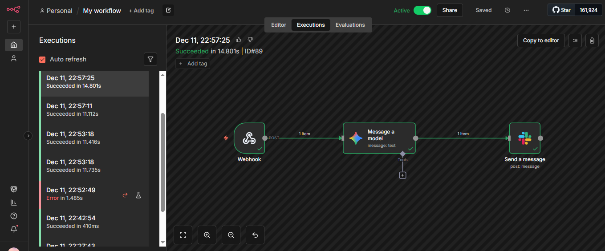
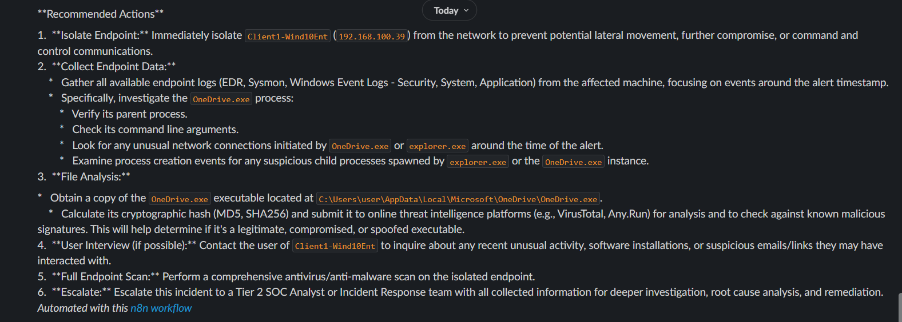
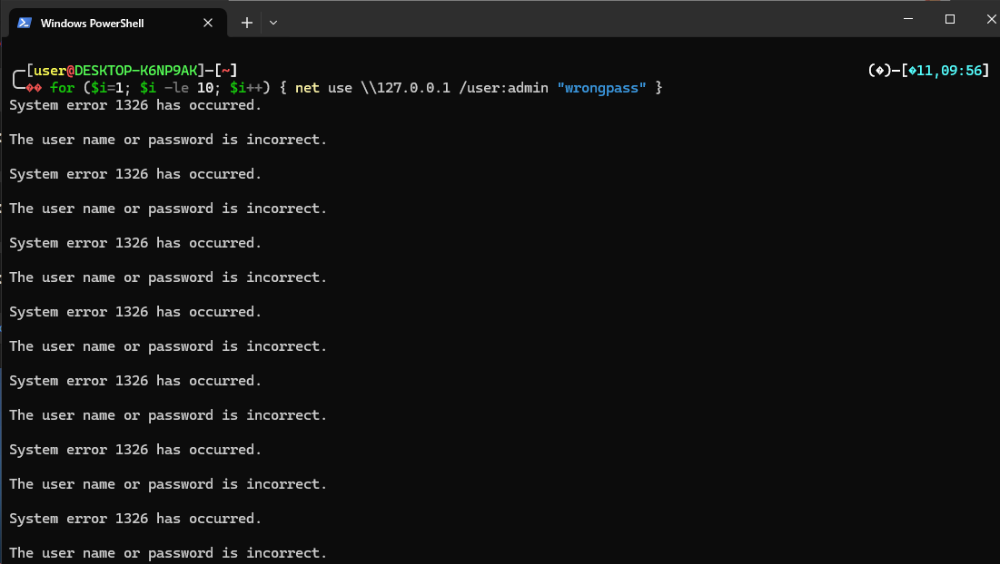
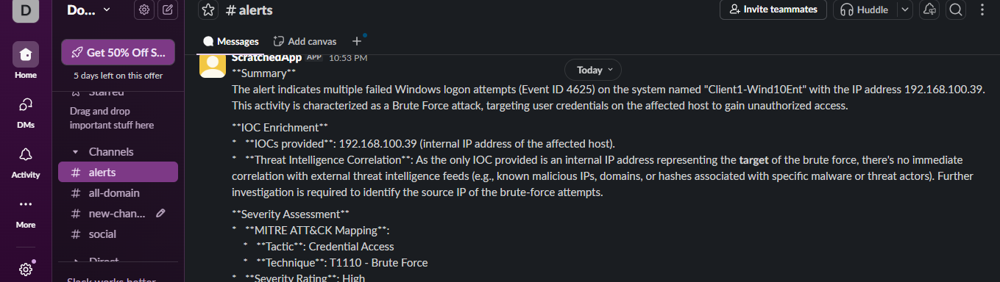
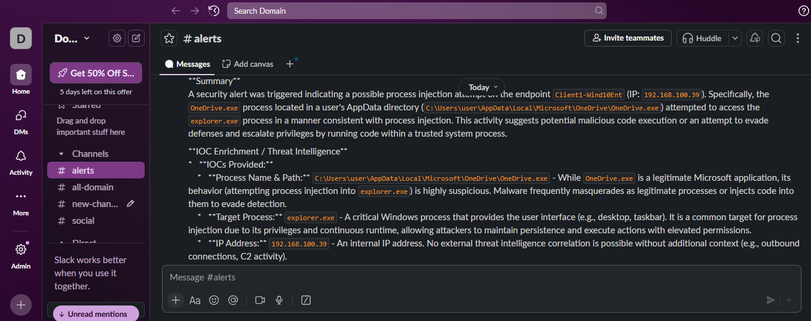

## Project Overview

This project builds a fully automated **Security Operations Center (SOC)** pipeline. It integrates a SIEM (Wazuh) with an automation platform (n8n) and Generative AI (Google Gemini) to detect, analyze, and report security threats in real-time.

**The Problem:** Traditional SOC analysts suffer from "Alert Fatigue" due to high volumes of logs.
**The Solution:** An automated pipeline that filters noise, uses AI to analyze critical threats, and provides actionable reports to **Slack**.

---

## Architecture

The pipeline consists of four main stages:

1. **Ingestion:** Wazuh Agent monitors a Windows 10 endpoint for suspicious activity (Sysmon + SecurityEvents).
2. **Detection:** Wazuh Manager identifies threats (Brute Force, Ransomware simulation).
3. **Orchestration:** n8n Webhook receives the alert and filters based on severity.
4. **Analysis & Response:** * **Low Priority:** Ignored to reduce noise.
    - **High Priority:** Sent to Google Gemini (LLM) for analysis.
    - **Alerting:** Formatted message sent to Slack with recommendations.



---

## 🛠️ Tech Stack & Lab Setup

| Component | Role | Details |
| --- | --- | --- |
| **Wazuh Manager** | SIEM | Hosted on Ubuntu Server (GCP) |
| **n8n** | SOAR | Hosted on Ubuntu via Docker |
| **Google Gemini** | AI Analyst | Model: `gemini-2.5-flash` |
| **Windows 10** | Victim | Running Wazuh Agent & Sysmon |
| **Slack** | Alerting | Custom App with Webhook integration |

---

## Key Features Implemented

### 1. Dual-Lane Logic Switch

I engineered a logic switch in n8n to handle alerts differently based on severity:

- **Lane 1 (Noise):** Single failed logins (Rule `60122`) are dropped to prevent spam.
- **Lane 2 (Critical):** Brute Force (`60204`) or Critical (`Level >= 10`) alerts are escalated to the AI.

### 2. AI-Powered Analysis

Integrated Google Gemini to act as a Tier 1 Analyst.

- **Input:** Alert Rule, IP, User, Mitre Tactic.
- **Prompt Engineering:** Designed a strict prompt to force "SOC Analyst" style output (Headers, Analysis, Recommendations).
- **Output:** Clean Markdown summaries sent to Slack.

  

### 3. Attack Simulations

Tested the pipeline against real-world attack scenarios:

- **Brute Force:** PowerShell script generating 10+ failed logins in 1 second.

```powershell
for ($i=1; $i -le 10; $i++) { net use \\127.0.0.1 /user:admin "wrongpass" }
```



- **Ransomware Behavior:** `vssadmin delete shadows` command execution to simulate backup deletion.

  **Result:** The system detected the spike and sent this alert to Slack:



### 4. Automated Smart Reporting
Every high-priority alert triggers a comprehensive Slack notification containing:
* **Suspicious Activity:** Raw event details (User, IP, Rule Name).
* **AI Summary:** A plain-English explanation of *what* is happening.
* **Remediation:** Step-by-step actions for the analyst to take immediately.



---
